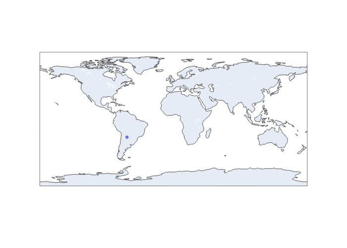

# Python Program to Track the International Space Station (ISS)

## This Python program does the following:

* uses the Open Notify API to track the location of the International Space Station 

* outputs the data of timestamp, latitude, and longitude to a spreadsheet file with .csv format 

* captures the data every hour for three days and write it to a .csv file named iss.csv 

* uses the csv.writer object to write the data to the file

* uses the time.sleep function to wait for the specified interval between each API call

* uses the urllib.request module instead of urllib2, as urllib2 is not available in Python 3.

* plots a map with a dot showing current location

* saves map to a png file as map.png